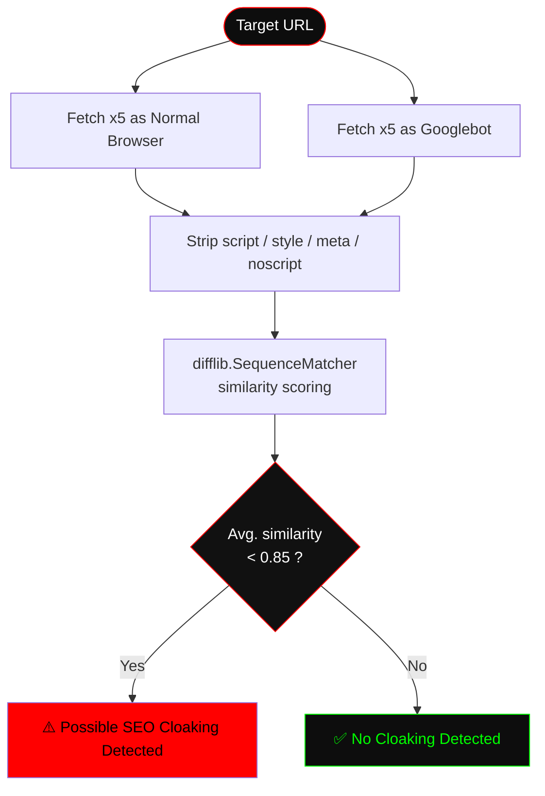

<div align="center">


<br>


</div>


## 🕵️ &nbsp;WHAT IS SEO CLOAKING?

**SEO cloaking** is a black-hat technique where a website serves **different content to search engine bots than to real human visitors** — usually to manipulate search rankings while hiding the manipulation from anyone actually browsing the page.

**SEO Cloaking Detector** exposes that deception. It requests the same URL twice — once posing as a normal browser, once posing as **Googlebot** — strips away everything that isn't visible content (scripts, styles, meta tags), and measures how similar the two versions really are. A low similarity score means the site is showing bots and humans two different realities.

> Built for ethical hackers, red teamers, and cybersecurity researchers auditing sites for black-hat SEO manipulation.

<br>

## ⚡ &nbsp;HOW IT WORKS



<br>

## 🔧 &nbsp;FEATURES

<div align="center">

| | |
|---|---|
| 🧠 | Simulates requests from both **Googlebot** and a **normal browser** |
| 📄 | Strips non-visible content (`<script>`, `<style>`, `<meta>`, `<noscript>`) before comparing |
| 📊 | Scores text similarity with Python's `difflib.SequenceMatcher` |
| 🔍 | Flags possible cloaking when similarity drops below the `0.85` threshold |
| 🔁 | Pulls **5 samples per user-agent** to smooth out false positives from dynamic content |

</div>

<br>

## 📦 &nbsp;INSTALLATION

```bash
# Clone the repo
git clone https://github.com/romilleuva/SEO-Cloaking-Detector.git
cd SEO-Cloaking-Detector

# (Recommended) create a virtual environment
python -m venv venv
source venv/bin/activate      # Windows: venv\Scripts\activate

# Install dependencies
pip install -r requirements.txt
```

**Requirements:** Python 3.8+ · `requests` · `beautifulsoup4`

<br>

## 🚀 &nbsp;USAGE

```bash
python Checker.py
```

You'll be prompted for a target URL:

```
Enter the URL you want to check for cloaking: https://example.com
🔍 Scanning https://example.com for SEO cloaking...
📊 Similarity score: 0.42
⚠️ Possible SEO Cloaking Detected!
```

A clean result looks like this instead:

```
🔍 Scanning https://example.com for SEO cloaking...
📊 Similarity score: 0.97
✅ No cloaking detected.
```

<br>

## 🧬 &nbsp;UNDER THE HOOD

```python
NORMAL_USER_AGENT  = "Mozilla/5.0 (Windows NT 10.0; Win64; x64)"
GOOGLEBOT_USER_AGENT = "Mozilla/5.0 (compatible; Googlebot/2.1; +http://www.google.com/bot.html)"

# 1. Fetch 5x with each user-agent
# 2. Strip script/style/meta/noscript, extract visible text
# 3. Cross-compare every (user, bot) text pair with SequenceMatcher
# 4. Average the scores → similarity_score
# 5. similarity_score < 0.85  →  cloaking flagged
```

<br>

## ⚠️ &nbsp;RESPONSIBLE USE

This tool sends repeated automated requests to whatever URL you target (5 requests per user-agent, 10 total per scan). Use it only on:

- Sites you **own**, or
- Sites you have **explicit permission** to test

Respect `robots.txt`, rate limits, and each site's terms of service. This project is for **educational and authorized security-research use only** — the author is not responsible for misuse.

<br>

## 🗺️ &nbsp;ROADMAP

- [ ] Support for additional bot user-agents (Bingbot, Yandex, etc.)
- [ ] Configurable similarity threshold via CLI flag
- [ ] Batch scanning from a URL list / CSV
- [ ] JSON/HTML report export
- [ ] Async requests for faster multi-sample scans

<br>

## 🤝 &nbsp;CONTRIBUTING

Contributions, issues, and feature requests are welcome.

1. Fork the repo
2. Create your branch (`git checkout -b feature/amazing-feature`)
3. Commit your changes (`git commit -m 'Add amazing feature'`)
4. Push (`git push origin feature/amazing-feature`)
5. Open a Pull Request

<br>

## 📄 &nbsp;LICENSE

Distributed under the MIT License.

---

<div align="center">

Built by **[Romil Leuva](https://github.com/romilleuva)** 🔴


</div>
